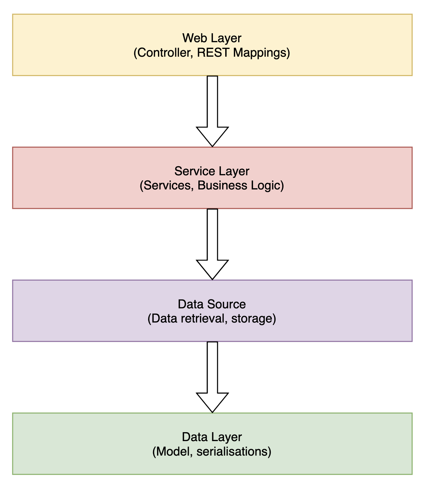

# SpringBoot_demo

## Demo SpringBoot project using Kotlin and JUnit 5

Techs and Tools
- Gradle
- Layered Architecture
- Test Driven Development following the FIRST Principles for Automated Tests*
- JUnit 5

## Architecture

### *F.I.R.S.T Principles for Automated Tests*
- **Fast** -> fast feedback loop, run often
- **Isolated** -> independent, arbitrary order
- **Repeatable** -> same result each time, not flaky
- **Self-validating** -> actual vs expected
- **Timely** -> with (or even before!) production code
